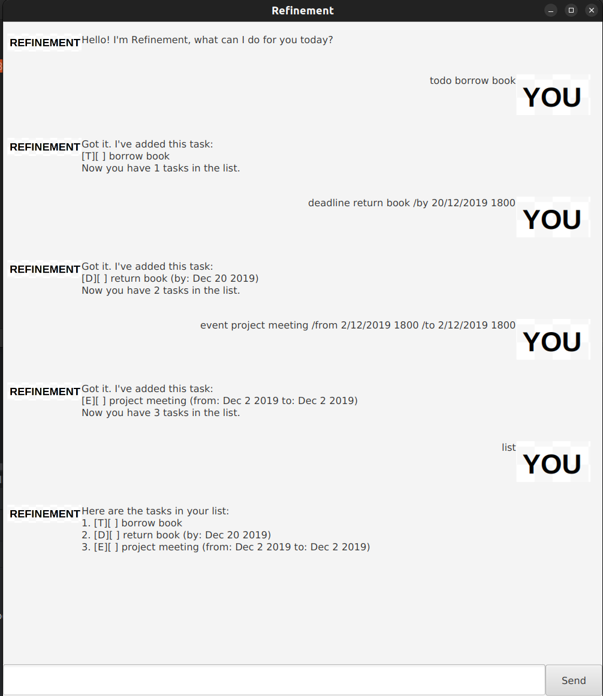

# Refinement User Guide



Refinement is yet another Chatbot designed for CS2103T.
It contains a minimal list of tasks for the user to do.

## Exit Refinement

Format: `bye`

## List all tasks

List all tasks in your task list.

Format: `list`

Expected output:
```
<list of tasks and their statuses printed out>
```

## Adding deadlines

Add a deadline to the list of tasks.

Format: `deadline <content> /by dd/mm/yyyy HHmm`

Example: `deadline return book /by 20/12/2019 1800`

Expected output:
```
Got it. I've added this task.
<Task content>
Now you have <Number> task in the list.
```

## Sort

Sort all deadlines by `/by` dates. All other tasks don't get sorted.

Format: `sort`

Expected output:
```
<All tasks in the list, with deadlines sorted and apearing first.>
```

## Adding todos

Add a todo to the list of tasks.

Format: `todo <content>`

Example: `todo borrow book`

Expected output:
```
Got it. I've added this task.
<Task content>
Now you have <Number> task in the list.
```

## Adding events

Add an event to the list of tasks.

Format: `event <content> /from dd/mm/yyyy HHmm /to dd/mm/yyyy HHmm`

Example: `event project meeting /from 2/12/2019 1800 /to 2/12/2019 1800`

Expected output:
```
Got it. I've added this task.
<Task content>
Now you have <Number> task in the list.
```


## Mark/Unmark

Mark/unmark whether something is done.

Format:
* `mark`
* `unmark`

Expected output:
```
<The specific task that is marked/unmarked.>
```

## Delete

Delete a task from the list.

Format: `delete <task number>`

Example: `delete 1`

Expected output:
```
Noted. I've removed this task.
<The specific task that is deleted.>
Now you have <Number> tasks in the list.
```

## Find

Find a task with content matching what you're searching for.

Format: `find <content>`

Example: `find book`

Expected output:
```
Here are the matching tasks in your list:
<list of matching tasks>
```

## Credits

Portions of the source code is referenced from the
[CS2103T website](https://nus-cs2103-ay2324s2.github.io/website/index.html),
and the [SE-EDU website](https://se-education.org/guides/index.html).
And the following StackOverflow link:
https://stackoverflow.com/questions/10654236/java-save-object-data-to-a-file.
Best-effort attempts have been made to add comments directly referencing
which part of the code was used, inside this repository.

Some of the code also came originally from the template project for Duke, and I thus
acknowledge CS2103T teaching team as the authors for those sections.